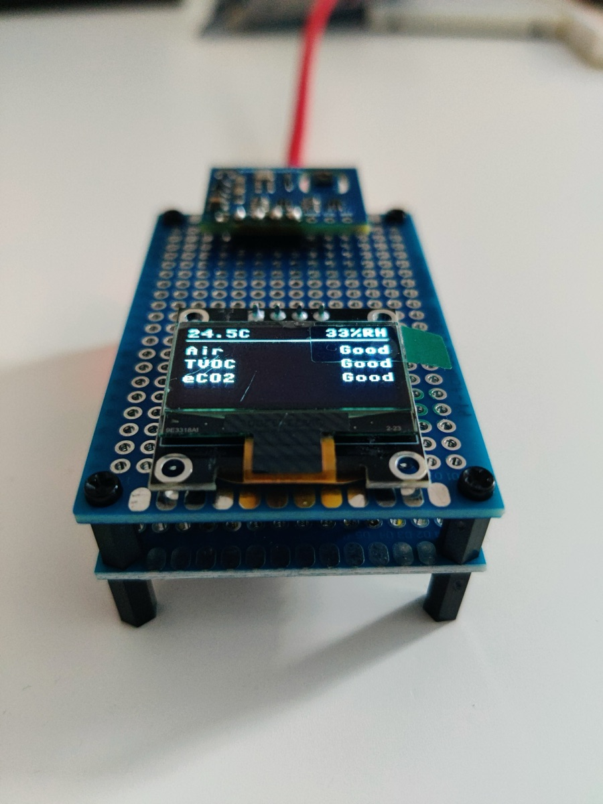
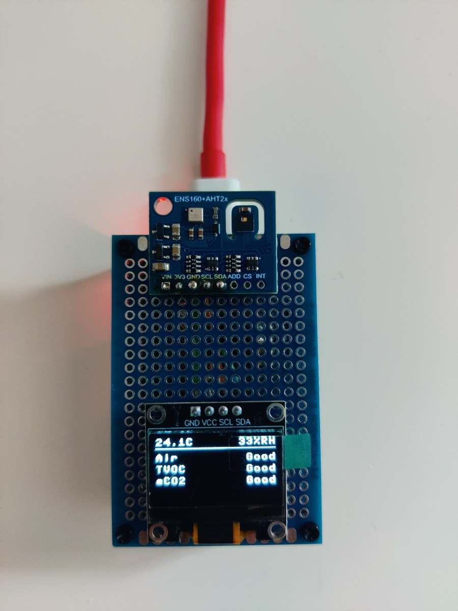
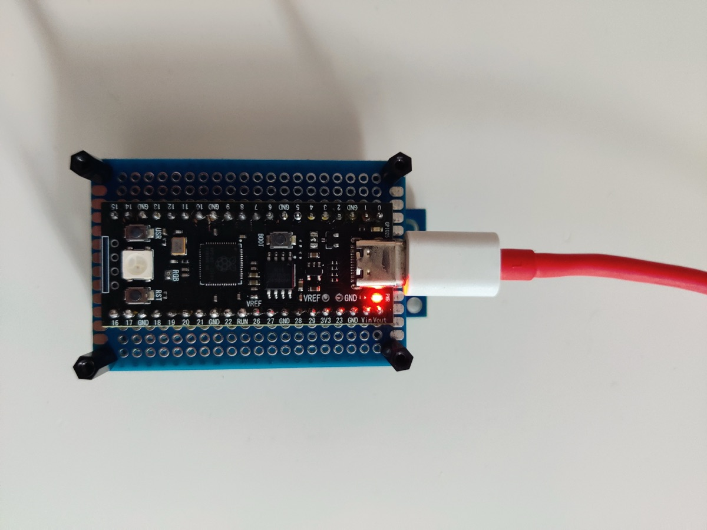

# Desktop air-quality station

A Raspberry Pi Pico-compatible board that measures temperature, humidity and indoor air quality, and shows the results on a small OLED screen. It starts by itself as soon as it gets USB power. No computer is needed once the code is on the board.

## The finished build

<p>
  
  
  
</p>

## Reading the screen

```
21.4C      49%RH
----------------
Air     Moderate
TVOC    Moderate
eCO2    Good

[ WARMING UP... ]
```

The top line shows temperature in °C and relative humidity in %. Below the divider are three air-quality lines, each rated with one of five words. A white bar appears at the bottom only when something needs your attention.

### What the air lines measure

**Air** is the sensor's overall verdict. The ENS160 chip works out its own Air Quality Index from 1 to 5, mostly from the TVOC level. If you only look at one line, look at this one.

**TVOC** (total volatile organic compounds) covers the gases that come from cooking, cleaning products, paint, glue, new furniture, perfume, alcohol and people breathing. Smells usually mean TVOC is up.

**eCO2** is an estimate of carbon dioxide, which is how "stuffy" a room feels. The sensor doesn't measure CO2 directly. It infers it from the other gases people breathe out, so treat it as a guide rather than a lab reading. Outdoor air is about 420 ppm, and the sensor never reports below 400.

### What the words mean

Air and TVOC use the German Environment Agency (UBA) indoor air scale, with the TVOC steps converted to ppb as in the ENS160 datasheet.

| Word | Air (AQI) | TVOC (ppb) | What to do |
|---|---|---|---|
| Excellent | 1 | below 65 | Nothing |
| Good | 2 | 65 to 219 | Nothing |
| Moderate | 3 | 220 to 659 | Open a window when it suits you |
| Poor | 4 | 660 to 2199 | Ventilate soon |
| Unhealthy | 5 | 2200 and up | Ventilate now and look for the source |

eCO2 has its own words, based on UBA's CO2 guidance. CO2 at these levels makes a room stuffy and people drowsy, but it isn't toxic, so the scale tops out at Poor rather than Unhealthy.

| Word | eCO2 (ppm) | What to do |
|---|---|---|
| Excellent | below 450 | Nothing, this is outdoor air |
| Good | 450 to 799 | Nothing |
| Acceptable | 800 to 999 | Nothing yet |
| Stuffy | 1000 to 1999 | Open a window |
| Poor | 2000 and up | Ventilate now |

A word that keeps flipping between two levels means the value sits right on a boundary. That's normal and not a fault.

### The red light

The big RGB LED on the board pulses red, fading up and down every 2 seconds, while Air reads Unhealthy (AQI 5). Ventilate and look for the source. It goes dark again as soon as Air drops to Poor or better. It never lights during warm-up or when a sensor shows `ERR`.

### Status bar messages

| Message | Meaning |
|---|---|
| `WARMING UP...` | The gas sensor is heating up. The air lines show `--` until it's ready. |
| `ERR - retrying` | A sensor stopped answering. The lines it feeds show `ERR`. The station retries every 2 seconds and recovers by itself once the sensor answers again. |
| `INVALID DATA` | The sensor reports its readings can't be trusted. This is rare. Unplug the station for a few seconds and plug it back in. |
| (no bar) | Everything is working. |

## Things to expect

**About 3 minutes of warm-up after plugging in.** The ENS160 has a tiny heater that must reach temperature before readings mean anything. Pressing the reset button doesn't restart the warm-up, because the sensor stays powered.

**The first day or two is less accurate.** A new ENS160 adjusts its baseline over roughly its first 24 hours of running. Expect the air words to be a level or so off at first, often too pessimistic. Leave it running.

**The raw temperature reads about 3 °C high.** The gas sensor's heater warms the small board it shares with the temperature sensor. `main.py` corrects for it, plus a small humidity offset. See [Correcting the temperature](#correcting-the-temperature).

**Placement matters.** Keep the station away from direct sun, radiators, your laptop's exhaust and your face. Breathing on it sends TVOC and eCO2 up for a minute.

## Hardware

| Part | I2C address |
|---|---|
| RP2040 board (Pico clone with RGB LED and USB-C) | n/a |
| ENS160 + AHT21 combo board | AHT21 at `0x38`, ENS160 at `0x53` |
| 0.96" SSD1306 OLED, 128x64 | `0x3C` |

The sensor board and the OLED share one I2C bus:

| Wire | Pico pin |
|---|---|
| VCC (sensor `3V3`, OLED `VCC`) | pin 36, 3V3 OUT |
| GND | pin 38, GND |
| SDA | pin 6, GP4 |
| SCL | pin 7, GP5 |

SDA must go to SDA and SCL to SCL on every board. During setup the sensor's two data wires were crossed, and the OLED kept working while the sensor vanished from the bus. If the air lines ever show `ERR` after you rewire, check those two wires first.

## Files

All files live in this folder, with a copy on the Pico.

| File | What it does |
|---|---|
| `main.py` | Runs automatically on power-up: the read loop, screen layout, serial output and error recovery |
| `aht21.py` | Driver for the AHT21 temperature and humidity sensor |
| `ens160.py` | Driver for the ENS160 air-quality sensor |
| `ssd1306.py` | Standard MicroPython OLED driver (I2C part only) |

The board runs MicroPython v1.29.0, the official `RPI_PICO` build.

## Working with the board from a Mac

Install the tool once:

```
uv tool install mpremote
```

Common commands:

```
mpremote                     # watch the live readings (Ctrl-] to quit)
mpremote fs ls :             # list files on the Pico
mpremote fs cp main.py :     # copy a changed file to the Pico
mpremote reset               # restart the Pico so it runs the new code
```

While you're watching with `mpremote`, Ctrl-C stops the program and gives you a Python prompt, and Ctrl-D restarts it.

The serial console prints a line every 2 seconds with the actual numbers:

```
T 21.4C  RH 48.5%  |  AQI 3 (Moderate)  TVOC 633 ppb (Moderate)  eCO2 905 ppm (Acceptable)  |  OK
```

## Customising

All of these are edits to `main.py`. Copy the file to the Pico and reset it afterwards.

### Update interval

Near the top:

```python
UPDATE_INTERVAL_S = 2       # seconds between readings
```

### Where the levels start

```python
TVOC_LIMITS = (65, 220, 660, 2200)     # ppb
ECO2_LIMITS = (450, 800, 1000, 2000)   # ppm
```

Each number is where the next word begins. For TVOC that's Good, Moderate, Poor, Unhealthy. For eCO2 it's Good, Acceptable, Stuffy, Poor. For example, to make eCO2 count as Stuffy only from 1200 ppm, change `1000` to `1200`. The words live in `TVOC_WORDS` and `ECO2_WORDS`.

### Correcting the temperature

The station applies a fixed temperature offset and humidity offset, set near the top of `main.py`:

```python
TEMP_OFFSET_C = -2.9
RH_OFFSET = 1.4             # percentage points
```

They were calibrated on 2026-10-07 against a second AHT21 placed away from the sensor board. Once both had settled, the board read 23.9 °C / 47.3 % and the reference 21.1 °C / 48.7 %. With the offsets applied, the two agreed within 0.3 °C and 1 % over a 3-minute check. That was at about 21 °C, so in a much warmer or colder room the offset may drift a few tenths.

To recalibrate, set both to `0`, let the station run for at least 10 minutes, compare it with a thermometer and hygrometer you trust, and set each offset to (reference − station).

Humidity gets a plain offset. The station used to recalculate humidity for the cooler room, on the theory that the warm sensor reads it low. The calibration showed the humidity reading hardly moves with the board's warmth, so that recalculation put it about 8 points too high. The corrected values are also what goes to the ENS160 as compensation.

### The red light

```python
LED_PIN = 23                # the board's WS2812 RGB LED
LED_PULSE_MS = 2000         # one fade up and down
LED_MAX = 120               # peak red brightness, 0-255
```

Lower `LED_MAX` if the pulse is too bright at night. To light it at Poor as well, change `r["aqi"] == 5` to `r["aqi"] >= 4` in `is_critical()`.

### Screen layout

Everything on screen is drawn in `draw()`. A comment above it shows the pixel row of each line. Useful facts:

- The font is 8x8 pixels, so a line holds 16 characters, and the screen holds 8 lines.
- `oled.text("hello", x, y)` draws text with its top-left corner at pixel `x, y`.
- `text_right("hello", y)` aligns text to the right edge.
- `oled.hline(x, y, width, 1)` draws a horizontal line.
- Nothing appears until `oled.show()` runs at the end of `draw()`.

If your OLED has a yellow strip across the top, that strip covers rows 0 to 15. Text placed across row 15 and 16 gets split between two colors.

## Troubleshooting

**The screen is blank.** Check the USB cable and the OLED's VCC and GND wires. Then run `mpremote` and look for errors in the output.

**The Mac doesn't see the board.** Try another cable, since many USB cables carry power only. Plug straight into the Mac, not through a hub.

**You need to reinstall MicroPython.** Hold the **BOOT** button, plug in the USB cable, then release the button. A drive called `RPI-RP2` appears. Download the `RPI_PICO` UF2 from <https://micropython.org/download/RPI_PICO/> and copy it onto that drive. The board restarts with an empty filesystem, so copy the four `.py` files back afterwards:

```
mpremote fs cp main.py aht21.py ens160.py ssd1306.py :
```

**Checking that all three I2C devices respond:**

```
mpremote exec "from machine import I2C, Pin; print([hex(a) for a in I2C(0, sda=Pin(4), scl=Pin(5)).scan()])"
```

You should see `['0x38', '0x3c', '0x53']`. A missing address points to a loose or crossed wire on that board.

**The RGB LED pulses red.** The air is Unhealthy. See [The red light](#the-red-light). If it's lit but not pulsing, `main.py` isn't running. Run `mpremote` and look for errors.
